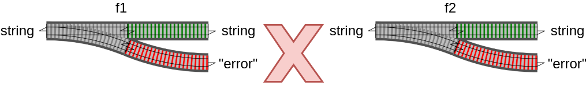
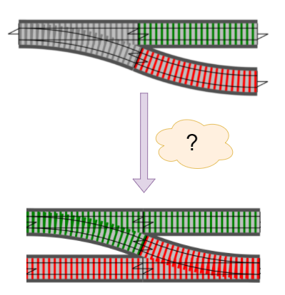

## Ergebnisse kombinieren

---

## Ergebnisse kombinieren

---

### Problem

Wir haben Funktionen mit
- Input: Single-Track
- Output: Two-Track

---

### Wir brauchen einen "Adapter"

---

"Adapter" muss in die `Result` Klasse eingebaut sein

- kein Hexenwerk
- es gibt fertige NuGet Pakete
- "zu Fuß"

---

"zu Fuß"
  
<pre><code data-noescape data-trim class="lang-csharp hljs">
static class ResultExtensions
{
    static Result&lt;TSuccess2, TError&gt; OnSuccess  //<-- FP-Jargon: "Bind"
        (this Result&lt;TSuccess, TError&gt; result,
        Func&lt;TSuccess, Result&lt;TSuccess2, TError&gt;&gt; func)
    {
        if (result.IsSuccess)
            return func(result.Success) // auspacken (!) und func geben

        return result.Failure;
    }
})
</code></pre>

---

---

