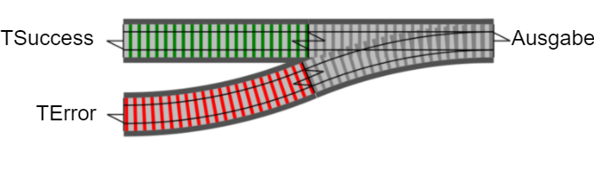

## Ergebnis ausgeben

----

## Ergebnis ausgeben

<pre><code data-noescape data-trim class="lang-csharp hljs">
static class ResultExtensions
{
    static K OnBoth&lt;T, K&gt;  //<-- FP-Jargon: "Pattern Matching"
        (this Result&lt;T&gt; result, Func&lt;Result&lt;T&gt;, K&gt; func)
    {
        return func(result);
    }
})
</code></pre>
