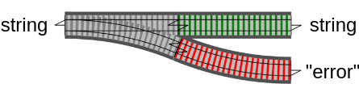
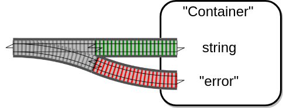
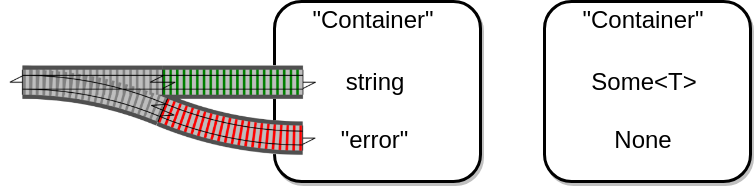
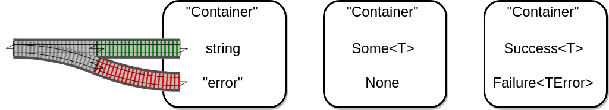
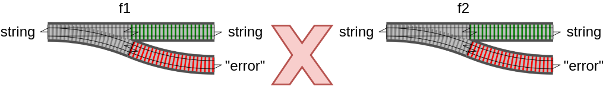
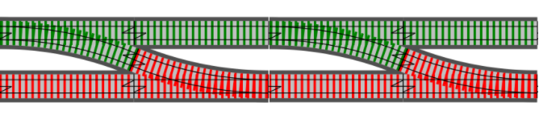
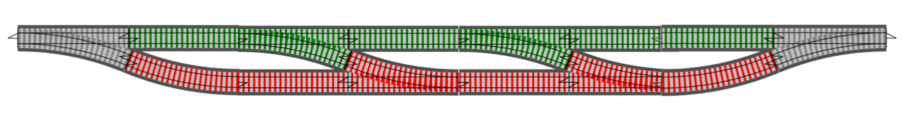

## Single track with switch

---



---



---



---



---

nennen wir `Container` besser `Result`

---

Funktionen, die fehlschlagen können, sollten `Result` zurückgeben

---

wie könnte eine `Result` Klasse aussehen?

```csharp
// Pseudo code (!)
class Result<TSuccess, TError> 
{
    TSuccess Success { get; }
    TError Failure { get; }

    private Result(TSuccess success, TError error) {
        Success = success;
        Failure = error;
    }

    static Success(TSuccess success) => Result(success, null);

    static Failure(TError error) => Result(null, error);

    bool IsSuccess => Success != null;
    bool IsFailure => !IsSuccess;
}
```

- `Result` muss eindeutigen Zustand haben...

---

Wie kann man Funktionen verketten?



- `f1` gibt `Result` zurück
- `f2` kann `Result` nicht entgegennehmen!

---

## Ziel: Two-track model



---

## Two-track model

### mit Anfang und Ende



---

`Result` muss **Single-Input Funktion** entgegennehmen

---

Single-Input Funktion mit `Result` Rückgabewert hat folgende Signatur:

```csharp
// Methode
Result<int, Error> f2(string input) { /*..*/ }

// Allgemein
Result<TSuccess, TError> f2(TInput input) { /*..*/ }
```

```csharp
// Funktion
Func<string, Result<int, Error>> func2

// Allgemein
Func<TInput, Result<TSuccess, TError>> func2
```

Eine Funktionssignatur verhält sich zu einer Funktion wie ein Interface zu einer Klasse

---

```csharp
Func<TInput, Result<TSuccess, TError>> func2
```

Das Lesen so einer Signatur benötigt anfangs etwas Übung...
