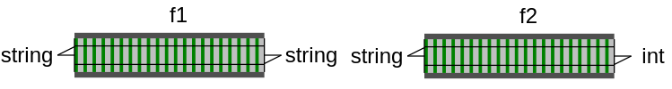
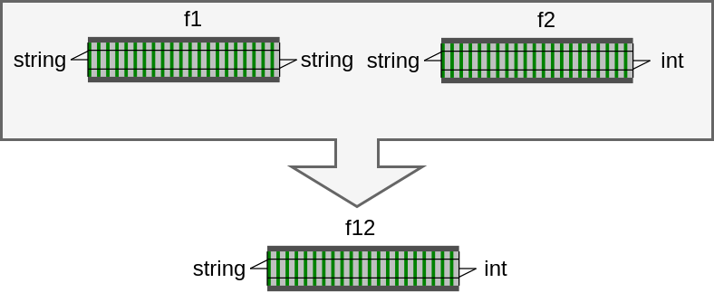
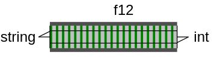
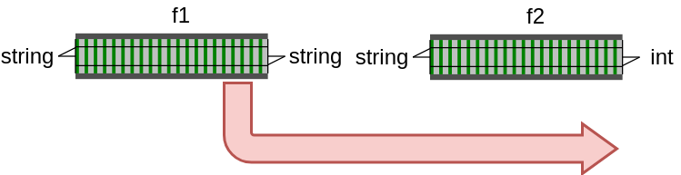

## Single track model

---


```csharp
string f1(string input) => input.ToUpper();
var result = f1("abc");     // -> "ABC"
```

---




```csharp
string f1(string input) => input.ToUpper();
int    f2(string input) => input.Length;

var r1 = f1("abc");
var r2 = f2(r1);   // -> 3
```

---

Composition



---

Composition



```csharp
string f1 (string input) => input.ToUpper();
int    f2 (string input) => input.Length;

int    f12(string input) => f2(f1(input)); // "Composition"

var result = f12("abc");     // -> 3
```

---



- `f1` kann fehlschlagen
- Komposition von `f1` und `f2` nicht möglich

```csharp
try {
    var resultF1 = f1(s); 
    var resultF2 = f2(resultF1);
} catch {
    // ...
}
```
